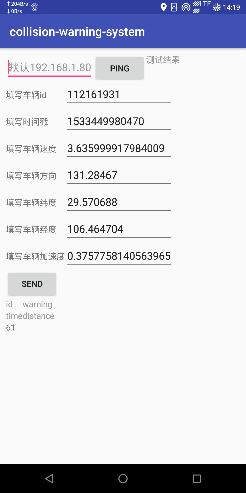

## Android 开发
### 负责人
[张浪](https://github.com/zhanglang111) 、[许新操](https://github.com/neardws) 
### Feature

* Android Studio: v3.1.3  
* Application name : collision-warning-system
* Company domain: cqu-bdsc.github.com
* Package name: com.github.cqu_bdsc.collision_warning_system
* Taget Api : API 21: Android 5.0 Lollipop

	dependencies {
	    implementation fileTree(include: ['*.jar'], dir: 'libs')
	    implementation 'com.android.support:appcompat-v7:28.0.0-alpha3'
	    implementation 'com.android.support.constraint:constraint-layout:1.0.2'
	    testImplementation 'junit:junit:4.12'
	    androidTestImplementation 'com.android.support.test:runner:1.0.1'
	    androidTestImplementation 'com.android.support.test.espresso:espresso-core:3.0.1'
	}

### debug
**~~bug.1~~**   Already fixed.
星期一, 16. 七月 2018 03:25下午 

	07-16 15:19:50.881 12121-15741/com.github.cqu_bdsc.collision_warning_system W/System.err: java.net.BindException: Address already in use
	07-16 15:19:50.882 12121-15741/com.github.cqu_bdsc.collision_warning_system W/System.err:     at java.net.PlainDatagramSocketImpl.bind0(Native Method)
	        at java.net.AbstractPlainDatagramSocketImpl.bind(AbstractPlainDatagramSocketImpl.java:96)
	        at java.net.DatagramSocket.bind(DatagramSocket.java:390)
	        at java.net.DatagramSocket.<init>(DatagramSocket.java:245)
	        at java.net.DatagramSocket.<init>(DatagramSocket.java:298)
	        at java.net.DatagramSocket.<init>(DatagramSocket.java:270)
	        at com.github.cqu_bdsc.collision_warning_system.udp.SendService.onHandleIntent(SendService.java:52)
	        at android.app.IntentService$ServiceHandler.handleMessage(IntentService.java:67)
	        at android.os.Handler.dispatchMessage(Handler.java:105)
	        at android.os.Looper.loop(Looper.java:156)
	        at android.os.HandlerThread.run(HandlerThread.java:61)

**bug.2**
	
	百度定位常见错误代码及其解决方案
	
	错误代码：62
	原因：无法获取有效定位依据，定位失败，请检查运营商网络或者WiFi网络是否正常开启，尝试重新请求定位。
	解决方案：查看是否未对APP赋予相应权限
	
	错误代码：161
	原因：网络定位结果，网络定位成功。
	解决方案：无法接收到GPS卫星信号，去室外宽阔的地方
	
	错误代码：61
	GPS定位成功
	

### 模块化开发
#### UDP 通信模块
接收功能已实现，发送功能有问题。

星期二, 24. 七月 2018 12:37下午 

已完成。

#### 信息采集模块

星期日, 05. 八月 2018 02:26下午 

已完成。

 