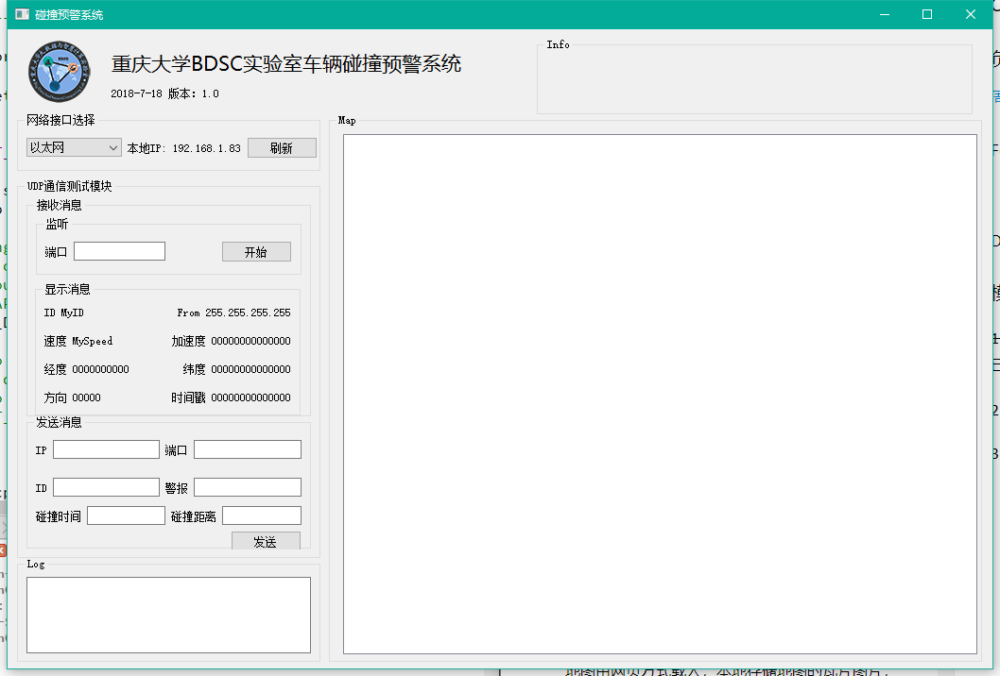
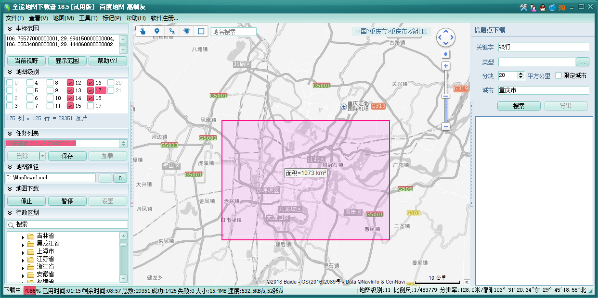

## QT-Server开发

### 负责人

[周易](https://github.com/Eva-zhouyi)、[许新操](https://github.com/neardws)

### Feature

- QT版本：5.11.1
- [QT Documentation](http://doc.qt.io/qt-5/)



### Debug

### 模块化开发

#### ~~1、UDP通信模块~~

已完成

#### 2、信息处理模块

#### 3、信息显示模块

1. ~~方案一：直接调用百度地图SDK（Pass）~~
   由于框架限制，本系统无法同时使用互联网资源调用百度地图的SDK，故采用方案二。

2. 方案二：加载百度离线地图

   地图由网页方式载入，本地存储地图的瓦片图片，QT与JavaScript进行交互。
   参考： [地图开发——离线地图技术选型](http://lixuanqi.me/2018/02/27/%E5%9C%B0%E5%9B%BE%E5%BC%80%E5%8F%91%E2%80%94%E2%80%94%E7%A6%BB%E7%BA%BF%E5%9C%B0%E5%9B%BE%E6%8A%80%E6%9C%AF%E9%80%89%E5%9E%8B/) and [Qt与百度地图交互(javascript)](http://kevinlq.com/2017/05/16/Qt_and_baiduMap_interaction/) and [QT实现加载百度离线地图](https://blog.csdn.net/john_kai/article/details/80290072)

   **采取此方案开发必要的前期准备：**

   - [百度离线地图API V2.1](http://www.xiaoguo123.com/p/baidumap_offline_v21/)
   - 瓦片地图
   - [百度地图JavaScript Document](http://lbsyun.baidu.com/cms/jsapi/reference/jsapi_reference.html#a0b0)
   - [百度地图API示例](http://developer.baidu.com/map/jsdemo.htm#a1_2)
     
       


3. ~~方案三：使用QT Location Open Street Map Plugin~~  \
   文档不全，且使用OpenStreetMap下载的OSM文件生成的地图文件只有点、线信息，不是很好看。
   

4. ~~方案四：使用高像素图片？~~\
   不太现实。

### Debug

野指针异常，请注意。
```
onecoreuap\inetcore\urlmon\zones\zoneidentifier.cxx(359)\urlmon.dll!6F02FA50: (caller: 6F02F768) ReturnHr(6) tid(a28) 80070002 系统找不到指定的文件。
```

### 接口说明

#### UDP模块

```cpp
/**
 * 通过UDP发送QJsonObject result
 * @brief MainWindow::onUdpSendMessage
 * @param result
 */
void MainWindow::onSendMessage(const QJsonObject &result){
    udpTargetAddr.setAddress(ui->editSendIP->text());
    udpTargetPort = ui->editSendPort->text().toInt();
    myudp->sendMessage(udpTargetAddr, udpTargetPort, result);
}
```

```cpp
/**
 * 将接收到的消息显示出来并将其发送到DataProcessThread
 * @brief MainWindow::onUdpAppendMessage
 * @param $from
 * @param message
 */
void MainWindow::onUdpAppendMessage(const QString &from, const QJsonObject &message){

    int    id           = message.find("id").value().toInt();
    int    timeStamp    = message.find("timeStamp").value().toInt();
    int    direction    = message.find("direction").value().toInt();
    double    lat          = message.find("lat").value().toDouble();
    double    lon          = message.find("lon").value().toDouble();
    double    speed        = message.find("speed").value().toDouble();
    double    acc          = message.find("acc").value().toDouble();

    ui->label_from->setText(from);
    ui->label_id->setText(QString::number(id));
    ui->label_timeStamp->setText(QString::number(timeStamp));
    ui->label_speed->setText(QString::number(speed));
    ui->label_direction->setText(QString::number(direction));
    ui->label_Lat->setText(QString::number(lat));
    ui->label_lon->setText(QString::number(lon));
    ui->label_acc->setText(QString::number(acc));

    processThread->addMessage(message);

}
```

#### 信息处理模块

```cpp
/**
 * 根据List计算结果
 * @brief DataProcessThread::ComputerResult
 * @param list
 */
void DataProcessThread::ComputerResult(const QList<QJsonObject> &list){
    QJsonObject result;
}
```
